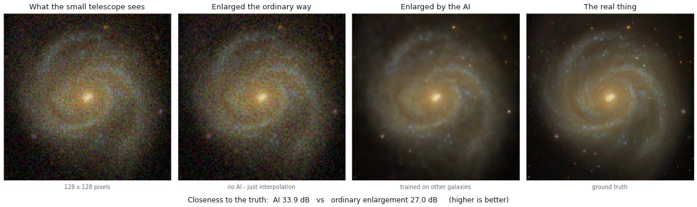

# Galaxy super-resolution — a live AI demo for teachers

A small neural network learns to sharpen blurred galaxy images. Built to be
run in front of a room of high school faculty in about 12 minutes, with
**no training and no internet during the demo**.



- `01_train.ipynb` — run once, ahead of time (~10 min, mostly downloading)
- `02_demo.ipynb` — the live notebook (loads saved weights, runs instantly)
- `demo_script.md` — what to say, beat by beat, with timings and a cut list
- `galaxy_sr/` — the actual code (~800 lines, heavily commented for a
  non-expert reader)

The trained weights and the demo galaxies are committed, so a fresh clone
runs `02_demo.ipynb` immediately — no download, no training, no account.

---

## Setup

```bash
git clone https://github.com/aryana-haghjoo/galaxy-ai-demo.git
cd galaxy-ai-demo
python3 -m venv venv
./venv/bin/pip install -r requirements.txt
./venv/bin/jupyter lab            # or just open the folder in VS Code
```

Then open `02_demo.ipynb` and run it top to bottom. It should work straight
away.

> **On an NVIDIA GPU**, check that the torch wheel matches your driver. If
> `torch.cuda.is_available()` is `False` and you get a "driver is too old"
> warning, install the build for your CUDA version, e.g.
> `./venv/bin/pip install --index-url https://download.pytorch.org/whl/cu128 torch`.
> Everything also runs on CPU, and fast enough to present from: a fraction
> of a second per galaxy rather than two milliseconds.

### Retraining from scratch (optional)

Run `01_train.ipynb` top to bottom. It will:

1. download ~300 real galaxy cutouts from the SDSS public archive into `data/`
   (8 at a time, giving up after `budget_min` minutes)
2. train the model for under a minute on a GPU
3. overwrite `weights/galaxy_sr.pt`
4. print a before/after so you can confirm it worked

**If the box has no internet**, everything still runs — the data step falls
back to simulated galaxies built from Sérsic profiles, spiral arms, dust
lanes and star knots. The result is less pretty but the demo is identical.
You will just want to say "these are simulated" once, which is a fine thing
to say in front of teachers anyway.

Pass `wandb_project="..."` to `train()` to log the run to Weights & Biases
(loss curve, held-out scores, and the checkpoint as an artifact). Off by
default so this works without an account.

---

## On demo day

Open `02_demo.ipynb`, **Restart Kernel**, then run cells one at a time as you
talk. Timings and script are in `demo_script.md`.

Two cells are meant to be edited live:

- `NAME = list(galaxies)[0]` — which galaxy you open with
- `PICK = list(galaxies)[1]` — the one the audience calls out
- `X, Y, SIZE = 150, 120, 160` — where the zoom box sits

Nothing else needs touching.

### If something goes wrong live

Every figure is also saved into `figures/` when you run it. **Run the
notebook once the night before** — that populates `figures/` with your
fallback set. If the kernel dies in the room, open those PNGs and keep
talking. The story survives without the live run.

---

## Knobs worth knowing about

In `01_train.ipynb`:

| Setting | What it does |
|---|---|
| `steps` | how long it trains. 6000 is plenty; the curve flattens early |
| `factor` | how much the image shrinks. 4 = throws away 15 of every 16 pixels |
| `sigma` | how badly the simulated small telescope blurs |
| `noise` | how noisy its detector is |
| `blocks`, `channels` | model size. Bigger = slower but sharper |

`sigma` and `noise` are set deliberately high (2.8 and 0.05). Milder damage
gives a better score but a *worse demo* — from the back of a room, the AI
panel and the ordinary-enlargement panel look identical. Cranking them up
makes the difference read instantly, and makes the AI's mistakes visible
too, which for this audience is the more useful half.

The demo notebook reads these back out of the checkpoint, so if you retrain
with different values everything downstream follows automatically.

---

## What the code does, in one paragraph

Take a good galaxy image. Blur it, shrink it 4×, and add noise — that is a
physically honest simulation of a smaller telescope. Now show a small
residual CNN the damaged version and grade it against the original. Repeat a
few thousand times. The network never memorises galaxies; it learns what
galaxy-shaped detail generally looks like, and uses that to make an educated
guess about what the missing pixels were. That is exactly why it sometimes
invents things — which is the most useful thing in the demo to show teachers.

Measured on 30 held-out galaxies the model never trained on:

| | closeness to truth |
|---|---|
| Ordinary enlargement (bicubic) | 28.2 dB |
| This model | 34.3 dB |

Data: [SDSS](https://www.sdss.org/) DR17 image cutout service, public, no key.

## Licence

MIT — see `LICENSE`. The SDSS imagery is public data; please credit SDSS if
you reuse the figures.
